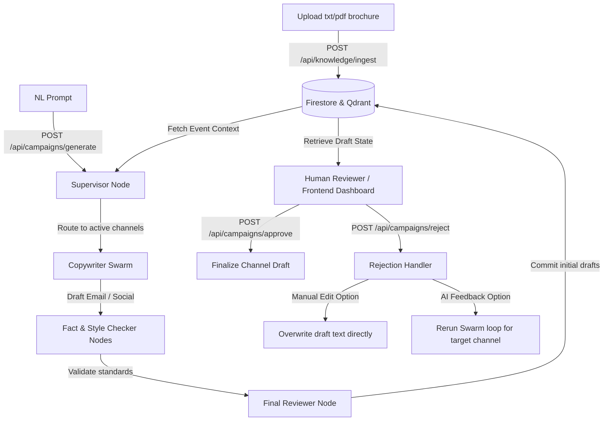

# HiDevs Swarm Copywriter Backend

An AI-driven multi-agent campaign copywriting engine built using **LangGraph**, **Google Gemini**, **Firestore**, and **Qdrant** vector database.

This project automates brochure document ingestion, semantic search context retrieval, and generates copywriting drafts for multiple marketing channels.

---

## 🏗️ Detailed Architecture & System Design

The system coordinates multi-agent copywriting, verification, and human-in-the-loop review through the following architecture:



### 1. Multi-Agent Swarm Flow (`agents.py` & `graph.py`)
Rather than relying on a single large prompt to write and verify copy, the system uses a **Supervisor-Worker Swarm** pattern built on LangGraph:
* **Supervisor**: Classifies the incoming prompt, determines which channels (e.g. `email`, `social`) are requested, and routes tasks to the appropriate copywriting agents.
* **Copywriters**: Independent agents specialized in writing copy for specific channels. Emojis are strictly banned in email drafts and permitted only in social posts (up to 3).
* **Verification Nodes (Fact & Style Checkers)**: Standardize compliance check routines. They cross-reference copy against vector database facts and check that reasoning logs are removed before outputting the final draft.
* **Final Reviewer**: Evaluates the copywriter drafts. If any check fails, it routes back to the copywriters with feedback. If they pass, it commits the drafts to Firestore.

### 2. State Management & Target Content Integrity
* **The State Map**: The LangGraph execution state tracks `email_draft`, `social_draft`, `newsletter_draft`, `revision_counts`, `review_feedback`, and `channel_statuses`.
* **The "is_rewrite" Safeguard**: When a user rejects a draft (e.g. `email`), the system runs the graph again *only* for the rejected channel. To prevent the rewrite loop from erasing other approved drafts or target content arrays, the `"is_rewrite": True` flag instructs the final reviewer to pull the existing campaign state from Firestore and merge the newly updated copy.

### 3. Duplicate Document Checking & "Clean-on-Ingest" updates (`ingest.py`)
* **Duplicate Verification**: To prevent duplicate files from filling up Qdrant collections and wasting API tokens, the system computes a unique MD5 file hash of raw document bytes (`calculate_file_hash`) during ingestion. It compares this hash against previous records in the Firestore `ingestion_metadata` collection. If the hash matches, it halts execution and raises a `400 Bad Request` explaining that the document is already saved.
* **Clean-on-Ingest (Updating Events)**: If you upload a modified brochure for the same event ID, the file hash will be different (allowing the upload). The system then automatically wipes out all old vector chunks in Qdrant for that specific `event_id` and `category` before inserting the new ones. It also overwrites the static event details (dates, price, registration URL) in Firestore. This allows developers to easily update event parameters by re-uploading with the same `event_id`.

### 4. Fuzzy Match Engine (`api.py`)
* When search terms have minor typos (e.g. `"banglore"` instead of `"bangalore"`), the search route uses `difflib.SequenceMatcher` to run word-level intersection calculations against registered events in Firestore. This provides typo-tolerant matching without requiring complex search server setups.

### 5. Supervisor Mismatch Safeguard (`agents.py` & `graph.py`)
* **Preventing Force-Mapping / Hallucinations**: If a user prompt requests a campaign for a course or subject that is completely unrelated to the active database list (e.g. asking for `"python bootcamp"` when only `"advanced_ai_agent_hackathon"` exists), the Supervisor agent outputs `"unrecognized"` for `event_id`. The state machine catches this and raises a validation error, preventing the agent from generating mismatched copy.

---

## 📖 API Endpoints Reference

### 📂 1. Campaign Generation & Review

#### `POST /api/campaigns/generate`
Launches the LangGraph swarm to generate initial drafts from an ingested brochure.
* **Payload:**
  ```json
  {
    "users_prompt": "generate campaign drafts for bangalore_hackthon",
    "target_content": ["email", "social"]
  }
  ```

#### `GET /api/campaigns/{event_id}`
Retrieves all generated copywriting drafts, revision metrics, and approval states for a specific event.

#### `POST /api/campaigns/approve`
Approves a specific copy channel (e.g. `email`). Sets the overall status to approved once all channels are approved.
* **Payload:**
  ```json
  {
    "event_id": "bangalore_hackthon",
    "channel": "email"
  }
  ```

#### `POST /api/campaigns/reject`
Rejects copy or saves manual human edits. Supports AI rewrite loop (using `feedback`) or direct manual overwrite (using `manual_edit` text):
* **AI Rewrite Loop:**
  ```json
  {
    "event_id": "bangalore_hackthon",
    "channel": "social",
    "feedback": "Make the hook stronger and mention that food is provided."
  }
  ```
* **Manual Overwrite:**
  ```json
  {
    "event_id": "bangalore_hackthon",
    "channel": "email",
    "manual_edit": "Subject: New Email Subject\n\nManually written copy body..."
  }
  ```

---

### 📂 2. Knowledge Base Management

#### `POST /api/knowledge/ingest`
Uploads a `.txt` or `.pdf` brochure. Returns a `400 Bad Request` if you upload a duplicate file. Passing an existing `event_id` allows you to update the event's brochure details, automatically wiping old vectors and replacing Firestore metadata.
* **Multipart Form:**
  * `file`: The document file (Required)
  * `event_id`: Custom database key. Use an existing ID to update event facts (Optional)
  * `category`: Folder class (Optional, e.g. `campaign`, `trainer_bio`)
* **Response Payload (New Creation):**
  ```json
  {
    "status": "success",
    "action": "created",
    "message": "File 'sample_event.txt' successfully created under event_id: 'bangalore_hackthon'."
  }
  ```
* **Response Payload (Existing Update):**
  ```json
  {
    "status": "success",
    "action": "updated",
    "message": "File 'sample_event.txt' successfully updated under event_id: 'bangalore_hackthon'."
  }
  ```

#### `GET /api/knowledge/events`
Lists all active events registered in your database.

#### `GET /api/knowledge/events/search`
Typo-tolerant fuzzy searching to lookup event details by keyword.
* **Query Parameter:** `query=keyword` (e.g., `query=banglore` matches `bangalore_hackthon`)

#### `DELETE /api/knowledge/{event_id}`
Permanently deletes brochure vectors, Firestore metadata, and campaign drafts for an event.

---

## 🚀 Setup & Execution Guide

### 1. Environment Setup & API Configuration
1. Install all dependencies inside your active Python environment:
   ```bash
   pip install -r requirements.txt
   ```
2. Create a `.env` file in the project's root folder and configure your API keys:
   ```env
   GEMINI_API_KEY=your_gemini_api_key
   Collection_name=Hidevs_knowledge_base
   QDRANT_URL=http://localhost:6333          # (Optional, defaults to http://localhost:6333)
   QDRANT_API_KEY=your_qdrant_api_key_here   # (Optional, only for protected or Qdrant Cloud instances)
   # Firestore credentials load automatically from firebase_key.json
   ```

### 2. Launch the API Server
Start the FastAPI server on port 8000:
```powershell
python -m uvicorn api:api --reload --port 8000
```
Once started, you can access the interactive Swagger API documentation at:
👉 **[http://127.0.0.1:8000/docs](http://127.0.0.1:8000/docs)**

---

## 🛠️ Windows Troubleshooting

### 1. DLL Load Failed (`cygrpc` Blocked)
If you see the error:
`ImportError: DLL load failed while importing cygrpc: An Application Control policy has blocked this file`

This is caused by Windows Defender Application Control blocking unsigned Python DLLs inside user folders.

* **The Fix (Run this in your active environment):**
  ```powershell
  pip install --force-reinstall --no-cache-dir grpcio
  ```
  If the error continues, search for **Smart App Control** in your Windows settings and toggle it **Off**.

### 2. Terminating Hanging Background Servers
If your terminal fails to start the server because port 8000 or database ports are already in use by a background python process.

* **The Fix (Kill all hanging Python processes):**
  * **In PowerShell**:
    ```powershell
    Stop-Process -Name python -Force
    ```
  * **In Command Prompt (CMD)**:
    ```cmd
    taskkill /F /IM python.exe
    ```

### 3. Connection Errors (Qdrant Server Offline)
The FastAPI server will start up and run even if your Qdrant container is offline. However, any request that requires semantic search (like `/api/knowledge/ingest` or `/api/campaigns/generate`) will return a `500` error or throw a connection exception.
* **The Fix**: Make sure your **Docker Desktop** application is running and that your Qdrant container is active and listening on port `6333`.
